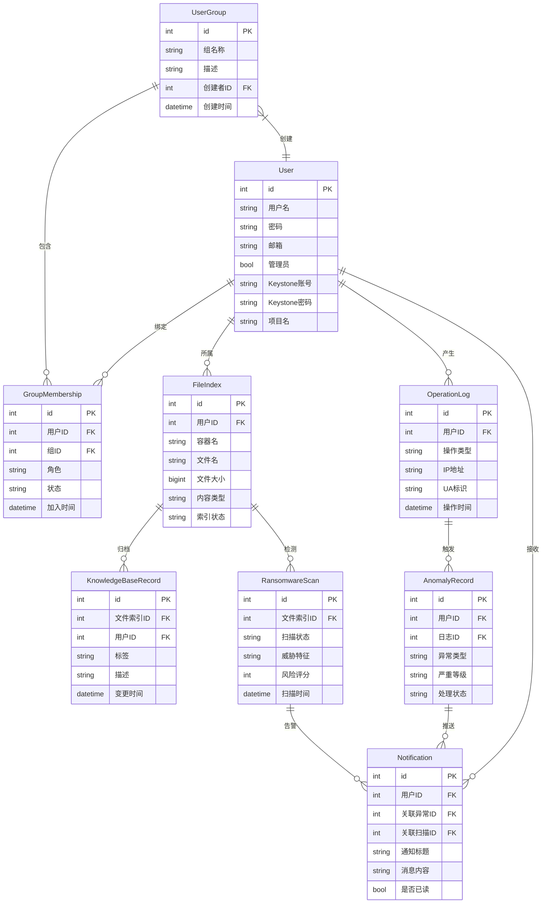

```mermaid
erDiagram
%% 全局收紧布局、放大可读性
%% 用户&权限
User {
    int id PK
    string 用户名
    string 密码
    string 邮箱
    bool 管理员
    string Keystone账号
    string Keystone密码
    string 项目名
}
UserGroup {
    int id PK
    string 组名称
    string 描述
    int 创建者ID FK
    datetime 创建时间
}
GroupMembership {
    int id PK
    int 用户ID FK
    int 组ID FK
    string 角色
    string 状态
    datetime 加入时间
}

%% 文件&知识库
FileIndex {
    int id PK
    int 用户ID FK
    string 容器名
    string 文件名
    bigint 文件大小
    string 内容类型
    string 索引状态
}
KnowledgeBaseRecord {
    int id PK
    int 文件索引ID FK
    int 用户ID FK
    string 标签
    string 描述
    datetime 变更时间
}

%% 安全审计
OperationLog {
    int id PK
    int 用户ID FK
    string 操作类型
    string IP地址
    string UA标识
    datetime 操作时间
}
AnomalyRecord {
    int id PK
    int 用户ID FK
    int 日志ID FK
    string 异常类型
    string 严重等级
    string 处理状态
}
RansomwareScan {
    int id PK
    int 文件索引ID FK
    string 扫描状态
    string 威胁特征
    int 风险评分
    datetime 扫描时间
}
Notification {
    int id PK
    int 用户ID FK
    int 关联异常ID FK
    int 关联扫描ID FK
    string 通知标题
    string 消息内容
    bool 是否已读
}

%% 核心关联（紧凑连线）
User ||--o{ GroupMembership : 绑定
UserGroup ||--o{ GroupMembership : 包含

User ||--o{ FileIndex : 所属
FileIndex ||--o{ KnowledgeBaseRecord : 归档
FileIndex ||--o{ RansomwareScan : 检测

User ||--o{ OperationLog : 产生
OperationLog ||--o{ AnomalyRecord : 触发

AnomalyRecord ||--o{ Notification : 推送
RansomwareScan ||--o{ Notification : 告警
User ||--o{ Notification : 接收
UserGroup }|--|| User : 创建
```